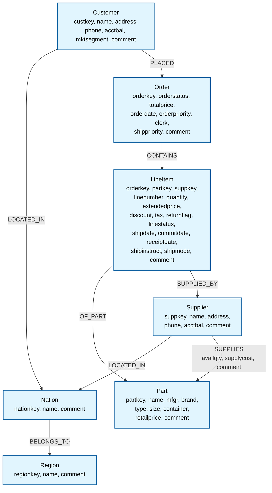

# 

# Graphonauts – Exploring the Graph “Space”

Welcome to **Graphonauts**, a project dedicated to exploring the fascinating world of graph databases and their capabilities.

> **Note:** This project is part of my diploma thesis and is currently a work in progress.

## About the Project
Graph databases are powerful tools for modeling and analyzing complex relationships. This repository focuses on:

- Understanding the strengths and weaknesses of different graph databases.
- Running benchmarks and queries using the TPC-H dataset.
- Exploring use cases and scenarios where graph databases excel.

## Graph Databases Explored
This project includes experiments with the following graph databases:

- **ArangoDB**
- **Memgraph**
- **NebulaGraph**
- **Neo4j**

## Dataset
The [TPC-H dataset](https://www.tpc.org/tpch/) is a decision support benchmark that consists of a suite of business-oriented ad-hoc queries and concurrent data modifications. It is widely used for evaluating database performance.

### Graph Representation of TPC-H Dataset
Below is a visualization of how the TPC-H dataset is modeled in a graph database. Each entity is represented as a node, and relationships between entities are modeled as edges:

### Queries to Test
We will test the following types of queries on the graph database:

#### A. Selection, Projection, and Source (of Data)
1. **Non-Indexed Columns**: Select supplier named 'Supplier#000000666'.
2. **Non-Indexed Columns — Range Query**: Select orders placed between `1990-01-01` and `1995-12-31`.
3. **Indexed Columns**: Select supplier with the ID `1337`.
4. **Indexed Columns — Range Query**: Select orders placed between `1990-01-01` and `1995-12-31`.

#### B. Aggregation
1. **COUNT**: Count the number of products per brand.
2. **MAX**: Find the most expensive product per brand.

These queries will help evaluate the performance and capabilities of the graph database in handling both traditional and graph-specific operations.

---

## Repository Structure
- `src/arangodb/` - Code and experiments for ArangoDB.
- `src/memgraph/` - Code and experiments for Memgraph.
- `src/nebulagraph/` - Code and experiments for NebulaGraph.
- `src/neo4j/` - Code and experiments for Neo4j.

## License
This project is licensed under the [MIT License](LICENSE).

---

Happy graph exploring! 🚀
