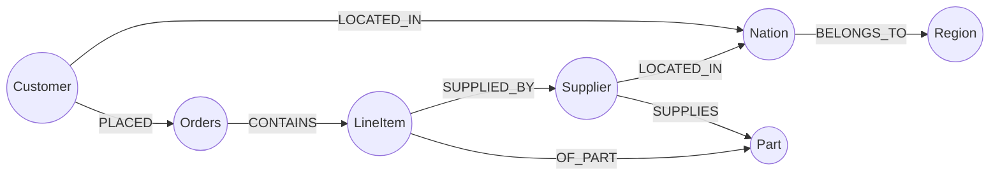
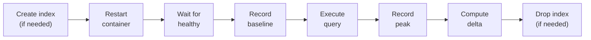
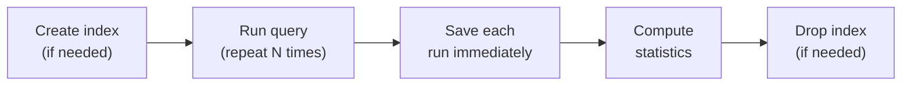

A benchmarking framework for comparative evaluation of graph database management systems. The framework loads the industry-standard TPC-H dataset into each database as a property graph, executes a suite of 19 queries spanning five operational categories, and measures both query execution time and memory consumption using isolated, reproducible measurement phases.

## Table of Contents

**[Part I — Benchmark Design](#part-i--benchmark-design)**
- [Databases](#databases)
- [TPC-H Dataset](#tpc-h-dataset)
- [Query Categories](#query-categories)
- [Benchmark Methodology](#benchmark-methodology)

**[Part II — Technical Reference](#part-ii--technical-reference)**
- [Setup](#setup)
- [Usage](#usage)
- [Results Structure](#results-structure)
- [Project Architecture](#project-architecture)
- [Adding a New Database](#adding-a-new-database)
- [Development](#development)


## Part I — Benchmark Design

### Databases

The following graph databases were selected from the [DB-Engines ranking](https://db-engines.com/en/ranking/graph+dbms) based on popularity, open-source or community edition availability, and Python driver support. They represent a diverse cross-section of query languages, storage engines, and architectural designs.

| Database    | Query Language      | Data Model                          | Storage                                  | Architecture (CE)      | Protocol            | Python Install                                |
|-------------|---------------------|--------------------------------------|------------------------------------------|------------------------|---------------------|-----------------------------------------------|
| Neo4j       | Cypher              | Property Graph                      | Native graph (on-disk)                   | Single-node            | Bolt                | `neo4j`                           |
| Memgraph    | Cypher (openCypher) | Property Graph                      | In-memory (WAL + snapshots)              | Single-node            | Bolt                | `neo4j`                           |
| ArangoDB    | AQL                 | Multi-model (Graph + Document + KV) | On-disk (RocksDB)                        | Single-node or cluster | HTTP / Velocystream | `python-arango`                   |
| DGraph      | DQL (GraphQL+-)     | Property Graph (RDF-inspired)       | On-disk (BadgerDB)                       | Distributed            | gRPC / HTTP         | `pydgraph`                        |
| NebulaGraph | nGQL                | Property Graph                      | On-disk (RocksDB-based)                  | Distributed            | Thrift RPC          | `nebula3-python`                  |
| JanusGraph  | Gremlin             | Property Graph                      | Pluggable (Cassandra, HBase, BerkeleyDB, etc.) | Distributed or single-node | WebSocket       | `gremlinpython`, `janusgraph-python` |

### TPC-H Dataset

The [TPC-H benchmark](https://www.tpc.org/tpch/) is a widely adopted decision-support benchmark that models a business scenario involving suppliers, customers, orders, and parts. While originally designed for relational databases, its rich entity relationships make it well-suited for graph database evaluation.

The dataset is loaded at **Scale Factor 1** and transformed into a property graph with nodes representing entities and edges representing relationships between them. The resulting graph schema is shown below:



```mermaid
graph LR
    Region((Region))
    Nation((Nation))
    Supplier((Supplier))
    Customer((Customer))
    Part((Part))
    Orders((Orders))
    LineItem((LineItem))

    Nation -- BELONGS_TO --> Region
    Supplier -- LOCATED_IN --> Nation
    Supplier -- SUPPLIES --> Part
    Customer -- LOCATED_IN --> Nation
    Customer -- PLACED --> Orders
    Orders -- CONTAINS --> LineItem
    LineItem -- SUPPLIED_BY --> Supplier
    LineItem -- OF_PART --> Part
```

The raw data resides in pipe-delimited `.tbl` files generated by the TPC-H `dbgen` tool:

| Entity   | Rows      | File         | Graph Role                          |
|----------|-----------|--------------|-------------------------------------|
| Region   | 5         | region.tbl   | Node                                |
| Nation   | 25        | nation.tbl   | Node, BELONGS_TO Region             |
| Supplier | 10,000    | supplier.tbl | Node, LOCATED_IN Nation             |
| Customer | 150,000   | customer.tbl | Node, LOCATED_IN Nation             |
| Part     | 200,000   | part.tbl     | Node                                |
| PartSupp | 800,000   | partsupp.tbl | Relationship, Supplier SUPPLIES Part |
| Order    | 1,500,000 | orders.tbl   | Node, PLACED by Customer            |
| LineItem | 6,001,215 | lineitem.tbl | Node, CONTAINS/OF_PART/SUPPLIED_BY  |

**Total: ~7.5 million nodes and ~21 million relationships.**

### Query Categories

The benchmark suite consists of 19 queries organized into five categories that exercise different aspects of graph query processing:

| Category     | Variants | Description                                                        |
|--------------|----------|--------------------------------------------------------------------|
| Selection    | 4        | Point lookups and range queries, both indexed and non-indexed      |
| Aggregation  | 2        | COUNT and MAX aggregations across node properties                  |
| Join         | 7        | Multi-hop traversals, shortest path, neighborhood search, optional match |
| Set          | 3        | UNION, intersection (common neighbors), difference (anti-join)     |
| Modification | 3        | Sorting with and without indexes, DISTINCT result sets             |

Queries that compare indexed versus non-indexed performance create the index before measurement and drop it afterward, ensuring index state does not leak between benchmarks.

### Benchmark Methodology

To obtain accurate and reproducible measurements, execution time and memory consumption are measured in **separate, independent phases**.

#### Memory Measurement

Each query is measured in isolation with a freshly restarted database container:


```mermaid
flowchart LR
    A["Create index\n(if needed)"] --> B["Restart\ncontainer"]
    B --> C["Wait for\nhealthy"]
    C --> D["Record\nbaseline"]
    D --> E["Execute\nquery"]
    E --> F["Record\npeak"]
    F --> G["Compute\ndelta"]
    G --> H["Drop index\n(if needed)"]
```

The container restart ensures a clean memory baseline free of residual allocations from prior queries. A background thread continuously samples container memory via the Docker stats API (approximately once per second), and memory values are adjusted for filesystem cache to reflect actual process memory. The result is the **memory delta** (peak − baseline), representing the additional memory consumed by the query.

#### Time Measurement

Each query is executed multiple times against a warm database without container restarts:


```mermaid
flowchart LR
    A["Create index\n(if needed)"] --> B["Run query\n(repeat N times)"]
    B --> C["Save each\nrun immediately"]
    C --> D["Compute\nstatistics"]
    D --> E["Drop index\n(if needed)"]
```

Each run is timed with `time.perf_counter()` (monotonic, highest resolution available) and saved as an individual JSON file immediately after completion. This ensures partial results are preserved if the process is interrupted. After all runs complete, aggregated statistics are computed: mean, median, standard deviation, min, max, and the 5th and 95th percentiles.

---

## Part II — Technical Reference

### Setup

#### Prerequisites

- Python 3.12+
- [Poetry](https://python-poetry.org/)
- Docker

#### Installation

```bash
# Install all dependencies (including all database drivers)
poetry install

# Install only a specific database driver
poetry install --only main,dev,neo4j
```

#### Start / Stop Database Containers

```bash
poe neo4j-up      # Start Neo4j
poe neo4j-down    # Stop Neo4j
```

### Usage

#### Load TPC-H Data

```bash
python -m graphonauts load neo4j
```

Shows task-level progress with checkmarks. Measures total load time and memory usage. Saves results to `benchmarks/load/neo4j/{timestamp}/`.

#### Verify Load

```bash
python -m graphonauts verify neo4j
```

Checks node and relationship counts against expected TPC-H values.

#### Run Benchmarks

```bash
# Run both memory + time for all queries (1 memory + 1 time run each, safe default)
python -m graphonauts benchmark neo4j

# Full statistical benchmark (1 memory + 50 time runs per query)
python -m graphonauts benchmark neo4j --runs 50

# All queries in a category
python -m graphonauts benchmark neo4j --category selection

# Specific query only
python -m graphonauts benchmark neo4j --category selection --query 1

# Memory only
python -m graphonauts benchmark neo4j --memory

# Time only, custom run count
python -m graphonauts benchmark neo4j --time --runs 50
```

By default, `benchmark` runs both memory and time phases with 1 time run. Use `--runs 50` for statistically robust results. Both phases run **query-by-query** (memory + time for selection 1, then memory + time for selection 2, etc.).

#### Compare Databases

```bash
# Compare all databases (default metric: median)
python -m graphonauts compare

# Compare specific databases with a custom metric
python -m graphonauts compare neo4j memgraph --metric mean
```

Prints three side-by-side tables: load (time and memory), per-query memory usage, and per-query execution time. Available metrics: `mean`, `median`, `min`, `max`, `p5`, `p95`.

#### Save Query Results

```bash
python -m graphonauts save neo4j
python -m graphonauts save neo4j --category selection --query 1
```

Runs each query once and saves fetched records for cross-database correctness comparison.

#### Re-compute Summaries

```bash
python -m graphonauts summarize neo4j
python -m graphonauts summarize neo4j --category selection --query 1
```

Re-generates `summary.json` from existing `run_NNN.json` files. Successful benchmark runs produce the summary automatically — this command is only needed if a run was interrupted before completion (individual run files are saved immediately, but the summary is computed at the end) or if the statistics code was updated and you want to re-compute summaries without re-running benchmarks.

### Results Structure

```
benchmarks/
├── load/
│   └── neo4j/{timestamp}/
│       ├── neo4j.json                # Load time + memory usage
│       └── memory.png                # Memory timeline plot
├── results/
│   └── neo4j/{category}/{variant}/
│       └── results.json              # Query records for cross-DB comparison
├── memory/
│   └── neo4j/{category}/{variant}/{timestamp}/
│       ├── memory.json               # Baseline, peak, delta (MB)
│       └── memory.png                # Memory timeline plot
└── time/
    └── neo4j/{category}/{variant}/{timestamp}/
        ├── run_001.json              # Individual run timing
        ├── run_002.json
        ├── ...
        └── summary.json              # Aggregated stats (mean, median, stdev, p5, p95)
```

Categories: `selection`, `aggregation`, `join`, `set`, `modification`.

### Project Architecture

```
src/
├── graphonauts/
│   ├── base/          # Database abstractions (protocols, result types, TPC-H schemas)
│   ├── commands/      # CLI command implementations (one file per command)
│   ├── neo4j_db/      # Neo4j implementation
│   ├── memgraph_db/   # Memgraph implementation
│   └── cli.py         # Click group entry point (thin dispatcher)
└── utils/             # Memory/time monitoring and unified output styling
```

The framework uses Python `Protocol` (structural typing) for database extensibility — no inheritance required. Each database module provides a client, loader, queries, and verification queries that match the protocol signatures.

### Adding a New Database

1. Create a new package under `src/graphonauts/` (e.g., `arangodb_db/`)
2. Implement `BaseClient` protocol — `connect()`, `areconnect()`, `aclose()`, `aexecute()`, `afetch()`
3. Implement `BaseLoader` protocol — `aload()`, `aclear()` (use `base/tpch.py` for CSV reading)
4. Define `QUERIES: dict[tuple[str, int], Query]` with the same 19 query keys
5. Define `VERIFY_QUERIES: list[VerifyQuery]` for data verification
6. Export a `DatabaseConfig` instance as `config` in `__init__.py`
7. Add a `docker-compose.yml` for the container setup
8. Register the module in `commands/__init__.py`'s `DB_MODULES` dict

### Development

```bash
# Format code
poe format-code

# Type checking
poetry run mypy src/
```
