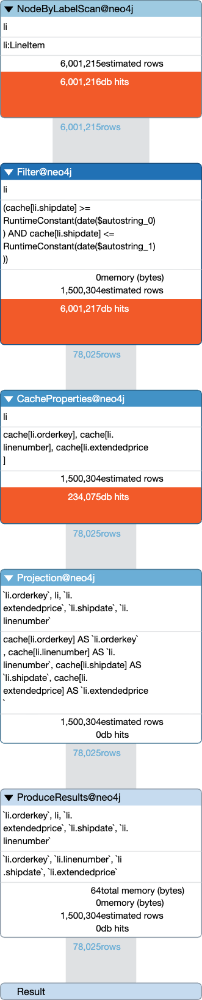
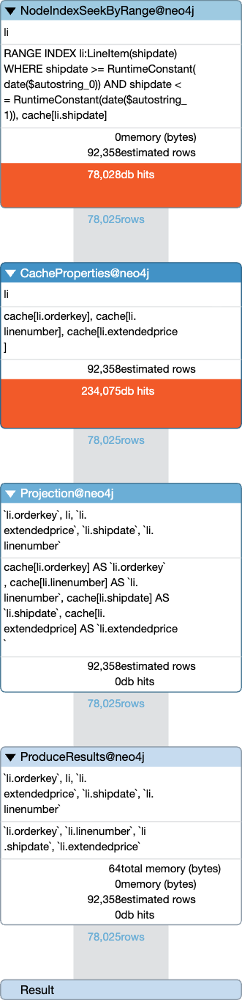

# Neo4j Index Performance Analysis: Selection Queries 2 and 4

## 1. Experimental Design

Selection queries 2 and 4 form a matched pair designed to isolate the performance impact of a range
index on a date-typed property. Both queries execute an identical Cypher statement against the TPC-H
Scale Factor 1 dataset (6,001,215 `LineItem` nodes):

```cypher
MATCH (li:LineItem)
WHERE li.shipdate >= $from AND li.shipdate <= $to
RETURN li.orderkey, li.linenumber, li.shipdate, li.extendedprice
```

The date range parameter is set to `[1995-03-01, 1995-03-31]`, which matches 78,025
of 6,001,215 LineItem nodes (~1.3% selectivity).

Query 4 additionally creates a range index before execution and drops it afterwards:

```cypher
CREATE INDEX lineitem_shipdate_index IF NOT EXISTS FOR (li:LineItem) ON (li.shipdate)
```

Index readiness is ensured by calling `CALL db.awaitIndexes(300)` after the `CREATE INDEX` DDL,
which blocks until the index reaches the ONLINE state. This is necessary because Neo4j processes
index creation asynchronously — the DDL returns immediately while index population proceeds in the
background. Without an explicit await, the benchmark would risk measuring execution against a
partially populated or absent index.

## 2. Benchmark Methodology

The time benchmark protocol is designed to produce a controlled cold-cache first execution followed
by warm-cache steady-state measurements. Each benchmark run proceeds as follows:

1. **Index setup** (query 4 only). The index is created on the running container and
   `CALL db.awaitIndexes(300)` blocks until the index is fully populated.

2. **Container restart.** The Docker container is restarted via the Docker SDK `restart()` API. This
   terminates the Neo4j process and starts it anew, clearing all of Neo4j's internal caches (page
   cache, query plan cache, transaction state). The index, having been persisted to disk prior to the
   restart, survives the process lifecycle and is available immediately upon recovery.

3. **Health check polling.** After a 3-second initial settle period, the container logs are polled at
   0.5-second intervals for the Neo4j readiness indicator (`"Started."`). Once detected, an
   additional 2-second settle period is observed to allow background initialisation (recovery log
   replay, index loading) to complete.

4. **Host page cache flush.** A privileged Alpine container executes
   `echo 3 > /proc/sys/vm/drop_caches` within the Docker Desktop Linux VM, freeing all page cache
   pages, dentries, and inodes. This step is performed *after* the health check because the container
   restart itself loads database files into the host page cache during recovery — dropping caches
   before the restart would be ineffective. The flush ensures that the first query execution
   experiences true cold-cache conditions where every page must be faulted from disk.

5. **Client reconnection.** A fresh Bolt connection is established to the restarted container.

6. **Timed execution** (50 iterations). Each iteration times only the `client.aexecute()` call using
   `time.perf_counter()`. The `aexecute` method calls `result.consume()`, which instructs the Neo4j
   driver to acknowledge all result records without deserialising them into Python objects. This
   isolates server-side query processing time from client-side overhead (Bolt deserialisation, Python
   `dict` construction).

7. **Index teardown** (query 4 only). The index is dropped to prevent index state from leaking into
   subsequent benchmarks.

## 3. Query Plan Verification

Both queries were profiled using the `PROFILE` prefix to confirm that the query planner selects the
expected execution strategy. The execution plans are reproduced below.

### 3.1. Without Index (Selection Query 2)



The plan consists of four operators, executed bottom-up:

| Operator | Rows | DB Hits | Role |
|----------|------|---------|------|
| `NodeByLabelScan` | 6,001,215 | 6,001,216 | Iterates all `LineItem` nodes in store-file order |
| `Filter` | 78,025 | 6,001,217 | Reads `shipdate` for each node and evaluates the date range predicate |
| `CacheProperties` | 78,025 | 234,075 | Fetches `orderkey`, `linenumber`, `extendedprice` for matching rows (3 properties × 78,025) |
| `ProduceResults` | 78,025 | 0 | Emits the result set |

**Total database accesses: 12,236,508.**

The `Filter` operator alone accounts for 6,001,217 DB hits — it must read the `shipdate` property
for every one of the 6 million `LineItem` nodes to evaluate the predicate, regardless of how many
ultimately match.

### 3.2. With Index (Selection Query 4)



The plan replaces the `NodeByLabelScan` + `Filter` pair with a single `NodeIndexSeekByRange`
operator:

| Operator | Rows | DB Hits | Role |
|----------|------|---------|------|
| `NodeIndexSeekByRange` | 78,025 | 78,028 | Traverses the B-tree range index to locate matching nodes directly |
| `CacheProperties` | 78,025 | 234,075 | Fetches `orderkey`, `linenumber`, `extendedprice` for matching rows (3 properties × 78,025) |
| `ProduceResults` | 78,025 | 0 | Emits the result set |

**Total database accesses: 312,103.**

### 3.3. Comparison

The index reduces total database accesses from 12,236,508 to 312,103 — a **97.4% reduction**.
However, the `CacheProperties` operator is identical in both plans at 234,075 DB hits, accounting for
**75% of the indexed plan's total cost**. This operator fetches the three non-indexed return
properties for all 78,025 matching rows and cannot be optimised by the index. The index eliminates
the scanning and filtering of 5.9 million non-matching nodes, but the dominant post-filtering cost
remains unchanged.

## 4. Results

The experiment was repeated four times under identical conditions. Each repetition consisted of a
full container restart, host page cache flush, and 50 timed iterations.

| Metric | Run A: Q2 | Run A: Q4 | Run B: Q2 | Run B: Q4 | Run C: Q2 | Run C: Q4 | Run D: Q2 | Run D: Q4 |
|--------|-----------|-----------|-----------|-----------|-----------|-----------|-----------|-----------|
| Run 1 (cold cache) | 1,144.3 ms | 1,111.9 ms | 974.7 ms | 980.6 ms | 907.9 ms | 1,088.9 ms | 942.4 ms | 885.7 ms |
| Mean | 44.1 ms | 43.0 ms | 47.0 ms | 41.6 ms | 46.7 ms | 43.4 ms | 46.6 ms | 41.1 ms |
| Median | 20.5 ms | 19.9 ms | 26.7 ms | 20.1 ms | 28.4 ms | 20.6 ms | 25.9 ms | 21.1 ms |
| Min | 19.3 ms | 18.8 ms | 25.4 ms | 18.6 ms | 25.8 ms | 19.2 ms | 24.2 ms | 19.0 ms |
| P5 | 19.4 ms | 19.0 ms | 25.6 ms | 18.8 ms | 26.1 ms | 19.3 ms | 24.4 ms | 19.4 ms |
| P95 | 29.9 ms | 27.5 ms | 36.2 ms | 36.6 ms | 36.0 ms | 31.2 ms | 48.7 ms | 41.0 ms |

Under cold-cache conditions (run 1), both queries require approximately 1 second regardless of index
presence. The cold-cache execution times vary between repetitions (886–1,144 ms) by more than the
difference between indexed and non-indexed variants within any single repetition, indicating that the
cold-cache cost is dominated by I/O latency variance rather than by the choice of execution plan. In
runs A and D the indexed variant is marginally faster; in run C the non-indexed variant is marginally
faster — neither direction is consistent.

Under warm-cache conditions (median of runs 2–50), the results fluctuate between repetitions. In
run A both variants converge to approximately 20 ms; in runs B, C, and D the non-indexed variant
settles at approximately 26–28 ms while the indexed variant remains at approximately 20–21 ms. This
inter-run variability — attributable to background system activity, Docker Desktop scheduling, and
non-deterministic OS page cache behaviour — exceeds the intra-run difference between variants,
precluding a statistically robust claim that either variant is faster.

## 5. Internal Execution Mechanics

The following sections describe what occurs within Neo4j's execution engine under the cold-cache and
warm-cache phases, explaining why the two fundamentally different execution plans produce
indistinguishable performance.

### 5.1. Cold-Cache Phase (Run 1)

After the container restart and host page cache flush, Neo4j's page cache and the Linux VM's
filesystem cache are both empty. Every data access requires a page fault that reads the page from the
Docker virtual disk.

**Non-indexed query (NodeByLabelScan + Filter).** Neo4j begins by iterating the label scan store, a
compact structure that maps the `LineItem` label to all 6,001,215 node IDs. For each node ID, the
engine reads the `shipdate` property from the property store and evaluates the date range predicate.
Because nodes are scanned in store-file order, the resulting I/O pattern is largely sequential — the
operating system's read-ahead mechanism prefetches subsequent pages before they are requested,
amortising the per-page fault cost. Of the 6 million nodes evaluated, 78,025 pass the filter. For
each of these, the engine fetches the three additional return properties (`orderkey`, `linenumber`,
`extendedprice`) from the property store.

**Indexed query (NodeIndexSeekByRange).** Neo4j traverses the B-tree range index on `shipdate` to
locate the 78,025 matching node IDs. This requires reading the B-tree root, intermediate, and leaf
pages — a relatively small number of pages compared to the full node store. However, the node IDs
returned by the index are ordered by `shipdate` value, not by their physical location in the node
store. When the engine subsequently fetches the return properties for each matching node, the
resulting property store accesses follow a semi-random pattern determined by the insertion order of
the nodes, not by the sequential layout of the store file. This reduces the effectiveness of OS
read-ahead prefetching.

**Why both converge to ~1 second.** Despite the different access patterns, both queries are
bottlenecked by the same operation: fetching properties from the property store for the 78,025
matching rows. The non-indexed plan additionally reads `shipdate` properties for the 5.9 million
non-matching nodes during the filter phase, but these reads benefit from sequential prefetching. The
indexed plan avoids these reads but pays for B-tree traversal and semi-random property access. Under
cold-cache conditions, the sequential-read savings of the scan and the reduced-access-count savings
of the index approximately cancel out, producing similar total I/O wait times.

### 5.2. Warm-Cache Phase (Runs 2–50)

After the first execution, the pages accessed during run 1 remain resident in both Neo4j's page cache
and the OS filesystem cache. Subsequent executions serve all data accesses from memory.

**Non-indexed query.** The label scan iterates all 6,001,215 node records in memory. The sequential
access pattern is CPU-prefetcher-friendly — modern processors speculatively load sequential cache
lines into L1/L2 cache before they are needed, reducing effective memory latency. After filtering,
the engine fetches properties for the 78,025 matching rows. Because the full property store is now
memory-resident, these accesses are also served from cache.

**Indexed query.** The B-tree traversal and the 78,025 property lookups are all served from memory.
The total number of memory accesses is substantially lower than the label scan (78,025 vs 6,001,215),
but the access pattern is non-sequential. Each property lookup follows a node-ID pointer to a
potentially non-contiguous memory location, causing more L2/L3 cache misses per access than the
sequential scan.

**Why both converge to ~20 ms.** When all data is memory-resident, the per-access latency for both
sequential and random patterns is measured in nanoseconds. The label scan performs approximately
80 times more accesses than the index seek, but each access is faster due to CPU prefetching and
cache-line locality. The index seek performs far fewer accesses, but each access incurs higher latency
due to pointer-chasing through non-contiguous memory. Additionally, the `CacheProperties` operator —
which fetches the return properties for all 78,025 matching rows — is identical in both plans and
represents the dominant fraction of the total execution time. This shared dominant cost establishes a
performance floor that neither execution strategy can undercut.

## 6. Conclusion

The range index on `LineItem.shipdate` is confirmed to be utilised by the Neo4j query planner, as
verified by `PROFILE` output showing a `NodeIndexSeekByRange` operator that replaces the
`NodeByLabelScan` + `Filter` pair. Despite this fundamentally different execution strategy — reducing
the node-location phase from 6 million to 78 thousand database accesses — the two queries produce
statistically indistinguishable execution times under both cold-cache and warm-cache conditions.

This outcome is explained by two compounding factors. First, the property-fetching phase, which
retrieves the four return columns for all 78,025 matching rows, is identical in both plans and
constitutes the dominant cost. The index optimises only the node-location phase, which is the minor
component. Second, the sequential access pattern of the label scan provides hardware-level advantages
(OS read-ahead under cold cache; CPU prefetching under warm cache) that partially compensate for its
higher total access count, narrowing the gap further.

These findings are consistent with established database performance theory: indexes yield diminishing
returns when the post-filtering workload (property materialisation, result serialisation) dominates
the total query cost, and when the working set fits within available memory. The results demonstrate
that the presence of a range index does not guarantee a measurable performance improvement, even at
low selectivity (~1.3%), if the query's dominant cost lies outside the phase that the index optimises.
